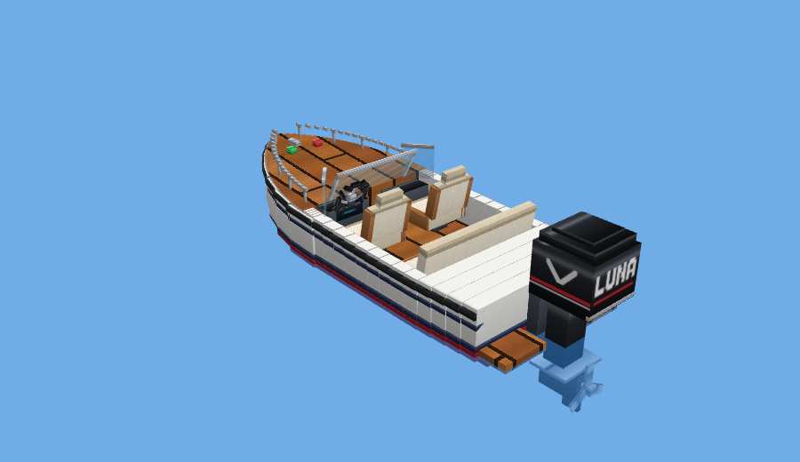

# Vroom! Vehicles

A Minecraft **Bedrock** add-on for Looney & Indy. They play on Nintendo Switch.
First up is a **speedboat**: a white runabout with a teak deck, cream leather
seats, a wrap-around windshield and a big outboard motor whose propeller spins
as you drive. The bow lifts when you speed up. The fleet below plans out all
20 vehicles.

**Easter eggs:** every vehicle hides the names **LUNA** and **INDI**
somewhere. On the speedboat, LUNA is on the back of the motor and INDI is
the boat's name on the transom.



**Vroom Garage** (`garage/index.html`) is a live 3D previewer. It shows each
finished vehicle on animated water with a sky, clouds and a wake. You can
change the throttle, the camera, the time of day, and switch between a
realistic look and the in-game look. Open it in any browser.

## The Switch catch (and the way around it)

The Switch can't import add-ons directly. Only Marketplace content installs
there. **A Switch can still join a world that has add-ons and download them
automatically.** So the plan is:

1. **Build and test** on a device that *can* import add-ons: a Windows PC
   (Minecraft for Windows), an iPad, or an Android tablet or phone.
   Macs can't run Bedrock.
2. **Make a world** on that device with both Vroom packs turned on.
3. **Share it with the Switch:**
   - **Realm (reliable):** Settings → Realms → *Replace world* with the
     Vroom world. The kids join the Realm from their Switch and get the packs
     on the way in. This needs a Realms Plus subscription.
   - **Same Wi-Fi (free, worth trying first):** open the world on the PC or
     iPad. The Switch sees it under *Friends* → *LAN Games*.

Keep **Experiments turned off** in the world settings. This add-on doesn't
need them, and Realms work best without them.

## Install (on PC, iPad or Android)

1. Download `dist/VroomVehicles.mcaddon` and open it. Minecraft imports
   both packs.
2. Create or edit a world → *Behavior Packs* → activate **Vroom! Vehicles**.
   The look-and-sound resource pack turns on with it.
3. Get a speedboat:
   - **Creative:** search the inventory for "Speedboat", or use its spawn egg.
   - **Survival:** craft **Oak Boat + Iron Ingot + Redstone**.
4. Place it next to the water and push it in, or place it on a block at the
   shoreline. Tap or right-click it to hop in. It seats three: a driver, a
   passenger and one on the back bench.
5. **Steering:** move forward, and the boat goes where you look.
   **Getting out:** sneak.
   **Picking it up:** punch it a few times and it drops the Speedboat item.

## Make changes

```
python3 tools/gen_art.py   # rebuild the model, paint job and item icon
node tools/preview.js      # render previews/ + pack icons (needs Playwright)
python3 tools/build_garage.py   # rebuild the Vroom Garage previewer
python3 tools/build.py     # check JSON, package dist/VroomVehicles.mcaddon
```

**How it looks realistic in a blocky game:** the model is about 500 small
boxes instead of 20. The curved bow is sliced half a pixel at a time and
covered with angled panels. Windshield, seat backs and steering wheel are
tilted. The paint is drawn at double resolution: gloss gradients, teak
planks, tufted leather, chrome reflections, and see-through glass.

| Want to change… | Edit |
|---|---|
| Speed | `minecraft:movement` → `value` in `packs/VroomVehicles_BP/entities/speedboat.json` |
| How slippery the water is | `minecraft:water_movement` → `drag_factor` (lower = glides further) |
| Where riders sit | `minecraft:rideable` → `seats[].position` (`[x, up, forward]` in blocks) |
| Colours and materials | the `m_*` painters in `tools/gen_art.py` |
| Shape | `half_width`, `deck_height`, `bottom_lift` and the `build_*` functions in `tools/gen_art.py`, or open the `.geo.json` in [Blockbench](https://www.blockbench.net) |
| Bow lift / propeller speed | `packs/VroomVehicles_RP/animations/speedboat.animation.json` |
| Recipe | `packs/VroomVehicles_BP/recipes/speedboat.json` |

When you change a pack, bump `version` in **both** `manifest.json` files.
Otherwise devices that already have the old version won't take the new one.

## The fleet: 20 vehicles

Lengths are in blocks (one block is one metre). We build them roughly in this
order. Each one teaches the add-on a new trick, and the next ones reuse it.

| Class | Vehicle | Length | New trick |
|---|---|---|---|
| Water | ✅ Speedboat | 3 | Floating, riding, steering, spinning propeller |
| Small | Jet Ski | 2 | Stand-up riding, spray |
| Water | Center Console | 4 | Twin outboards, T-top roof |
| Water | Offshore Racer | 6 | Very fast and long, nose lifts high at speed |
| Water | Wake Boat | 4 | Wakeboard tower, a big wake |
| Water | Pontoon Party Boat | 5 | Two floats, lots of seats |
| Water | Power Catamaran | 8 | Two hulls, a cabin you can walk in |
| Water | Superyacht | 14 | Several decks, built from parts |
| Small | Go-Kart | 2 | Driving on land, engine sounds |
| Small | Quad ATV | 2 | Off-road bouncing |
| Small | Dirt Bike | 2 | Leaning into turns |
| Small | Sport Bike | 2 | Speed, a wheelie when you boost |
| Land | Supercar | 3 | Opening doors, headlights |
| Land | Off-Road 4x4 | 3 | Climbing one-block steps |
| Land | Farm Tractor | 3 | Tilling farmland (starts the farm mod) |
| Land | Cyber Plow | 4 | Breaks blocks in front of it, using the Script API |
| Land | Monster Truck | 4 | Huge wheels, drives over cars |
| Air | Hot Air Balloon | 3 | Rising and sinking slowly |
| Air | Helicopter | 6 | Hovering |
| Air | Seaplane | 7 | Takeoff from water, flying |

## Realistic water, sky and clouds

Shaders, the add-ons that make Minecraft look photo-real on PC, can't run on
the Switch. What a resource pack can change on any device, the Switch
included:

- **Water:** colour, how clear it is, and its fog (per biome).
- **Sky:** sky and fog colours, a hand-painted cloud texture, and sun and
  moon textures.

Mojang's own realistic mode is called **Vibrant Visuals**. If the
kids' Switch offers it (Settings → Video → Graphics Mode), our vehicles get
its lighting too. A **Vroom Skies** pack that sets up the water and sky is
planned as a separate optional pack. That way it changes the whole world only
for people who want it.

**Jobs for Looney & Indy:** design each vehicle in Blockbench (it runs on an
iPad too), pick the colours and names, invent the recipes, and test-drive
every version.

**Names:** if we ever publish this publicly (CurseForge, MCPEDL), rename the
brand-name cars first. "Raging Bull Supercar" and "Cyber Plow" are fine;
Lamborghini and Tesla are trademarks.
